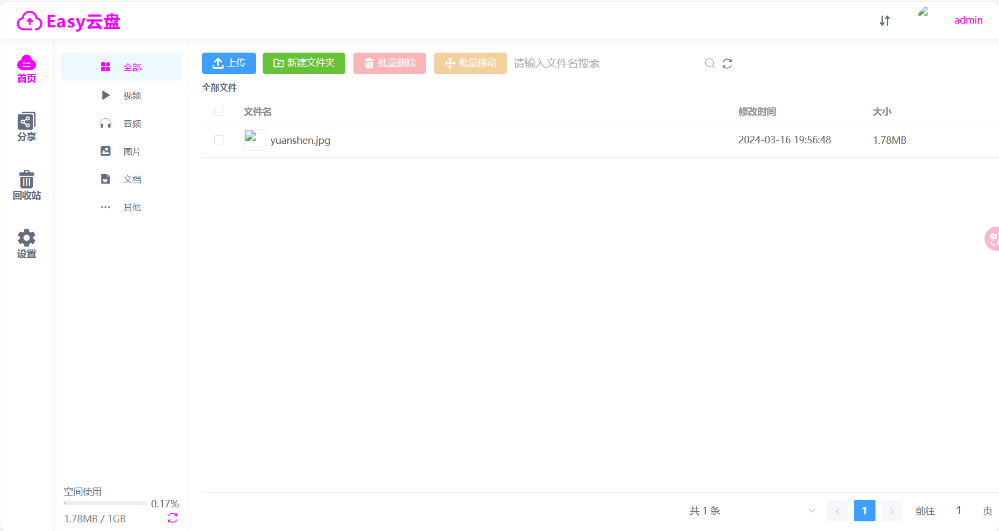
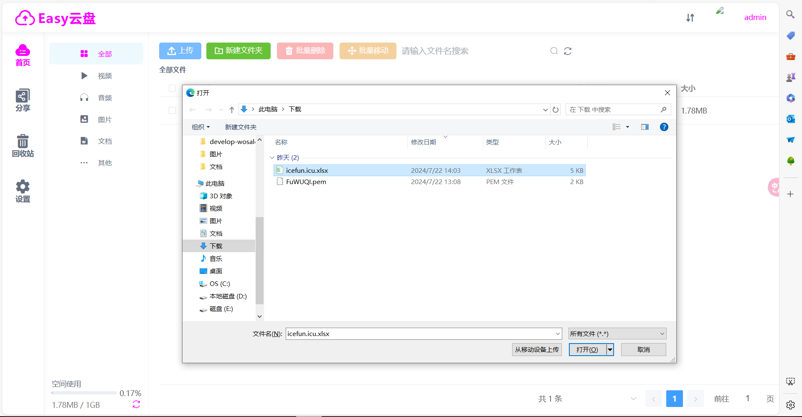
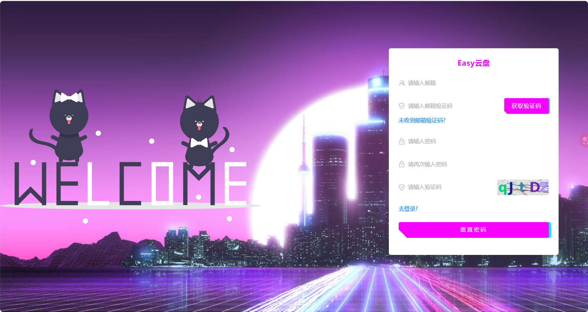
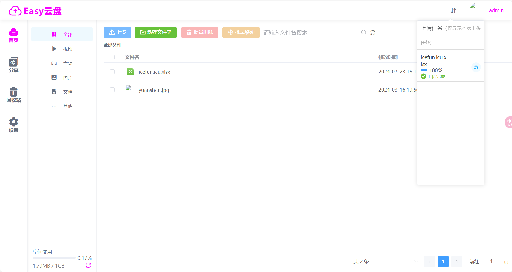

## 云盘项目
仿照百度网盘项目，实现了用户登录注册，文件上传下载，文件分享等功能，面向C端的WEB项目

实现了普通用户/管理员权限控制登录与注册，qq登录（逻辑代码实现，实际功能未开通）

具体功能
1.  用户注册，登录，QQ快捷登录，发送邮箱验证码，找回密码。
2.  文件分片上传，断点续传，秒传，上传进度展示，文件预览，新建目录，文件重命名，文件移动，文件分享，删除，下载 等功能。
3.  文件分享列表，取消分享。
4.  回收站功能，还原文件，彻底删除。
5.  设置模块  1、超级管理员可以看到所有用户上传的文件，可以对文件下载，删除。 2、超级管理员可以对用户进行管理，给用户分配空间，禁用、启用用户3、超级管理员可以对系统进行设置，设置邮箱模板，设置用户注册初始化空间大小。
6.  用户通过分享链接和分享码预览下载其他人分享的文件，同时也可以将文件保存到自己的网盘。
#### 以下为项目构造

#### 以下为项目运行效果
可以实现无账号时的注册，忘记密码时的重置密码以及有账号时的登录功能

忘记密码

主界面

文件上传

