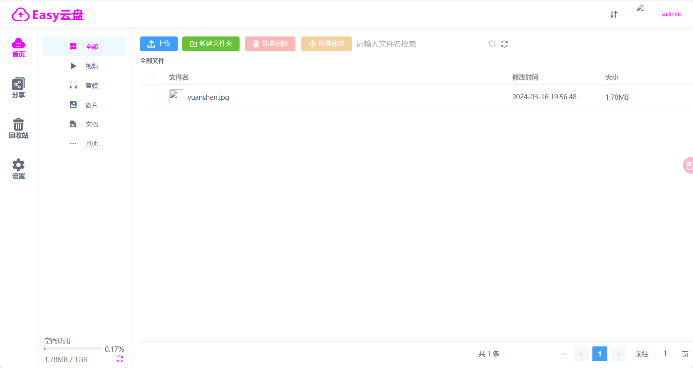
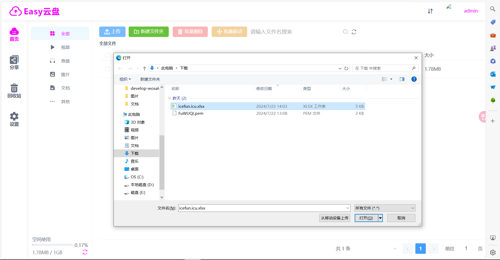
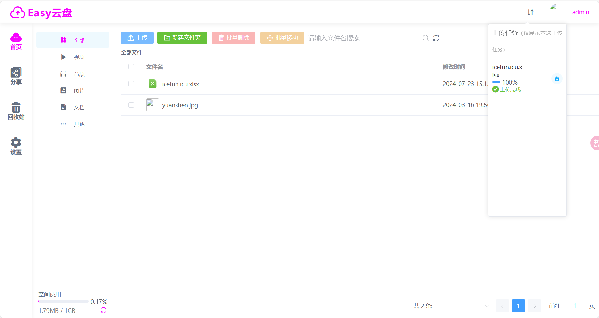

# EasyCloudPan 企业级网盘系统

[](LICENSE)
[](docs/STAR_REPO_HIGHLIGHTS.md)
[](AGENTS.md)

> 基于 **Spring Boot 2.6** + **Vue 3** + **Element Plus** 的高性能企业级网盘系统，支持 GB 级大文件断点续传、秒传、多媒体在线播放与精细化权限控制。



## ✨ 核心特性

- **🚀 高性能上传**
  - **分片上传**: 支持 GB 级文件分片并发上传，断点续传，网络中断无缝恢复。
  - **极速秒传**: 基于 MD5 文件指纹去重，实现毫秒级上传体验，节省存储与带宽。
  - **实时配额**: 基于 Redis 的实时空间配额管控，防止并发超卖。

- **🎬 多媒体中心**
  - **在线播放**: 集成 FFmpeg 实现视频自动转码与 HLS 切片，支持流媒体拖拽即播。
  - **全能预览**: 支持视频、音频、图片、PDF、Word、Excel、代码等多种格式在线预览。
  - **缩略图生成**: 自动生成图片与视频缩略图，提升浏览体验。

- **🛡️ 安全与权限**
  - **多维度认证**: 支持邮箱/图形验证码注册、密码加密存储、QQ 第三方登录。
  - **RBAC 控制**: 基于 AOP 的统一权限拦截框架，实现普通用户/管理员的角色隔离。
  - **资源隔离**: 用户文件物理隔离，回收站机制防止误删（支持撤销与彻底删除）。

- **🔗 协作与分享**
  - **灵活分享**: 支持自定义有效期（1天/7天/永久）与提取码的加密分享。
  - **转存机制**: 支持外部链接一键转存至个人网盘。

## 🛠 技术栈

### 后端 (Backend)
- **核心框架**: Spring Boot 2.6.1
- **持久层**: MyBatis + MySQL 8.0
- **缓存/消息**: Redis (缓存/配额/临时文件)
- **多媒体处理**: FFmpeg (视频转码/切片/截图)
- **工具库**: Hutool, JavaMail
- **日志**: Logback

### 前端 (Frontend)
- **核心框架**: Vue 3.x + Vite 4.x
- **UI 组件库**: Element Plus
- **网络请求**: Axios
- **文件处理**: Spark-MD5 (哈希计算), APlayer/DPlayer (媒体播放)
- **API 文档**: Springfox Swagger 3.0 (访问地址: `/api/swagger-ui/index.html`)

## 📂 项目结构

本项目采用前后端分离架构：
```bash
easyCloudPan/
├── backend/              # Spring Boot 后端源码
│   ├── src/main/java/com/easypan/
│   │   ├── aspect/       # AOP 切面 (权限/日志)
│   │   ├── component/    # 组件 (Redis/工具集)
│   │   ├── controller/   # 控制层接口
│   │   └── service/      # 业务逻辑层
│   └── file/             # 用户上传文件存储目录
├── frontend/             # Vue 3 前端源码
│   ├── src/
│   │   ├── components/   # 全局公用组件
│   │   ├── views/        # 页面视图 (Main/Uploader/Admin)
│   │   └── utils/        # 工具函数
├── database/             # 数据库初始化脚本 (easypan.sql)
└── docs/                 # 项目文档与资源
    └── STAR_REPO_HIGHLIGHTS.md # 技术亮点深度解析
```

## 🚀 快速开始

> **新手推荐**：请直接查看 [快速启动指南 (Windows)](QUICK_START.md)，使用一键脚本配置并启动。

### 手动启动 (高级用户)

1.  **数据库初始化**: 导入 [database/easypan.sql](database/easypan.sql)。
2.  **配置修改**: 修改 `backend/src/main/resources/application.properties`。
3.  **后端启动**:
    ```bash
    cd backend
    mvn spring-boot:run
    ```
4.  **前端启动**:
    ```bash
    cd frontend
    npm install
    npm run dev
    ```

## 📸 系统截图

| 登录与注册 | 文件列表与管理 |
|---|---|
|  |  |

| 视频在线播放 | 文件上传进度 |
|---|---|
|  |  |

## 🔗 相关文档

- [技术亮点深度解析 (STAR)](docs/STAR_REPO_HIGHLIGHTS.md) - 了解秒传、分片上传与异步转码的实现细节。
- [AI 协作规范 (AGENTS)](AGENTS.md) - 了解项目的代码规范与协作原则。

---

*Powered by EasyCloudPan Team*
